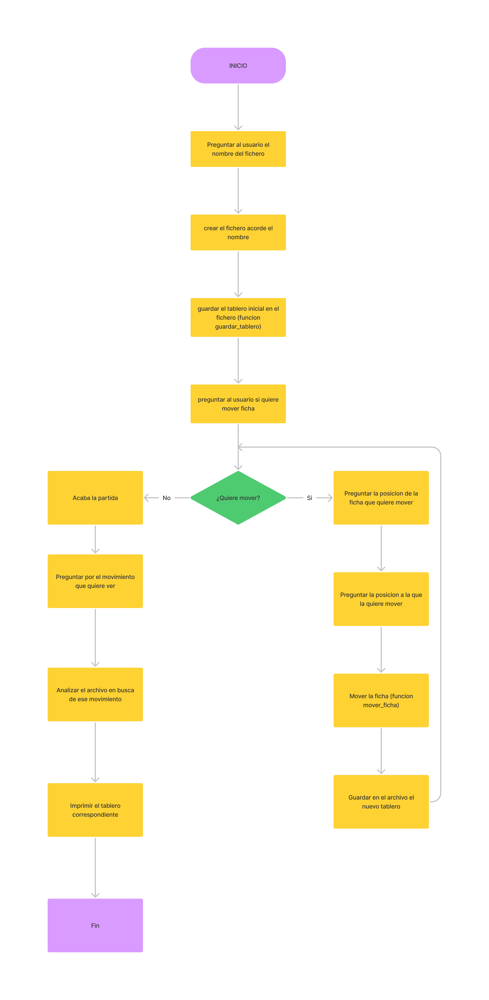

# Ajedrez
Mi direccion de GitHub para este repositorio es la siguiente: [GitHUb](https://github.com/AnaLopezP/Ajedrez.git)
https://github.com/AnaLopezP/Ajedrez.git

He creado un programa que guarda en un fichero las posiciones de las fichas de un ajedrez segun el o los usuarios juegan. Despues, imprime una posicion concreta del tablero segun el movimiento que le pide el usuario.
El diagrama de flujo que tenemos en nuestro código es el siguiente:


```tablero = [['TN1', 'CN1', 'AN1', 'RN', 'RYN', 'AN2', 'CN2', 'TN2' ], 
           ['PN1', 'PN2', 'PN3', 'PN4', 'PN5', 'PN6', 'PN7', 'PN8'],
           [' ', ' ', ' ', ' ', ' ', ' ', ' ', ' ',],
           [' ', ' ', ' ', ' ', ' ', ' ', ' ', ' ',],
           [' ', ' ', ' ', ' ', ' ', ' ', ' ', ' ',],
           [' ', ' ', ' ', ' ', ' ', ' ', ' ', ' ',],
           ['PB1', 'PB2', 'PB3', 'PB4', 'PB5', 'PB6', 'PB7', 'PB8'],
           ['TB1', 'CB1', 'AB1', 'RB', 'RYB', 'AB2', 'CB2', 'TB2',]]

contador = 0

def guardar_tablero(lista, file, contador):
    file = open(file + '.txt', "a")
    file.write("Movimiento " + str(contador) + "\n")
    for i in range(0, 8):
        for j in range(0, 8):
            if j == 7:
                file.write(str(lista[i][j]) + '\n')
            else:
                file.write(str(lista[i][j]) + '\t')
                
    

def mover_ficha(fila_ficha, columna_ficha, fila_casilla, columna_casilla):
    tablero[int(fila_casilla)][int(columna_casilla)] = tablero[int(fila_ficha)][int(columna_ficha)]
    tablero[int(fila_ficha)][int(columna_ficha)] = ' '

print("¿Como quieres que se llame el fichero?")
fichero = input()
guardar_tablero(tablero, fichero, contador)
print("tu archivo ha sido creado.\n¿Quieres mover o acabar la partida?")
decision = input()
while decision == 'mover':
    print("Dime la fila y la columna de la pieza que quieres mover. Ten en cuenta los 0")
    fila_ficha = input()
    columna_ficha = input()
    print("Ahora dime a que casilla la quieres mover")
    fila_casilla = input()
    columna_casilla = input()
    mover_ficha(fila_ficha, columna_ficha, fila_casilla, columna_casilla)
    contador = contador + 1
    guardar_tablero(tablero, fichero, contador)
    print("¿Qué quiere hacer ahora?")
    decision = input()
    movimiento = 'Movimiento' + str(contador)
    guardar_tablero(tablero, movimiento, contador)
print("Tu partida ha acabado, gracias por jugar.")


print("¿que movimiento quieres ver en pantalla? Dime el numero")
movimiento = input()
movimiento_str = "Movimiento " + str(movimiento) + "\n"

file = open(fichero + ".txt", "r")
linea = file.readline()

solucion = []
he_terminado = False
guardar = False
primeravez = False
while linea != "":
    if (linea == movimiento_str):
        guardar = True
        primeravez = True
    if guardar == True:
        solucion.append(linea)
    if linea.rfind("Movimiento") != -1 and primeravez == False:
        guardar = False
    primeravez = False     
    linea = file.readline()


for i in range(len(solucion)):
    print(solucion[i])

# Otra manera de print el movimiento: uso los nuevos archivos llamados movimiento1/2... e imprimo su contenido.
#print("¿Qué movimiento quieres ver en pantalla? Dime el numero.")
#movimiento = input()
#file = open('Movimiento' + str(movimiento) + ".txt", "r")
#print(file.read())
